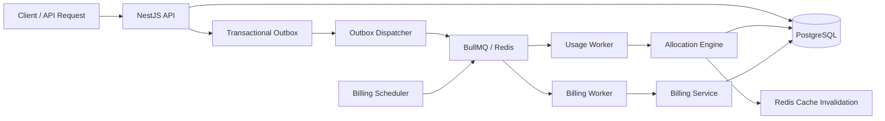
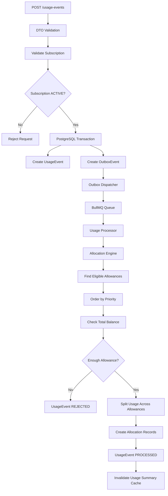
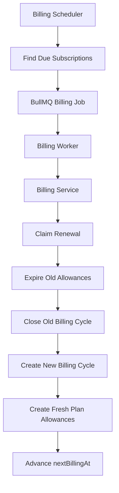

# OrbitX

**A backend-first telecom operations platform for subscriptions, usage processing, allowance allocation, billing automation, and reliability.**

OrbitX was built to explore real backend engineering problems beyond standard CRUD APIs.

The project focuses on state, asynchronous processing, transactions, idempotency, caching, background jobs, concurrency, authentication, and automated billing.

---

## Overview

OrbitX models the core operational layer of a telecom platform.

It manages:

- Customers
- Plans
- Subscriptions
- SIMs
- Data, voice, and SMS allowances
- Usage events
- Priority-based allocation
- Monthly billing cycles
- Authentication
- Background processing
- Caching
- Reliability and retries

The backend is the primary focus of the project.

The included landing page only provides a product-facing presentation of OrbitX.

> **Frontend note:** The OrbitX landing page was fully AI-generated by design. The engineering focus of this project is the backend.

---

## Architecture

OrbitX uses PostgreSQL as its durable source of truth.

Redis is used only for ephemeral workloads such as BullMQ and caching.



---

# Core Usage Flow

A usage request does not directly modify an allowance.

It moves through several layers first.



---

## Usage Ingestion

Usage events contain:

- Subscription
- Usage type
- Amount
- External event ID
- Occurrence time

Supported usage types:

| Type | Unit |
|---|---|
| DATA | MB |
| VOICE | Seconds |
| SMS | Count |

Every external event ID is unique.

Sending the same event multiple times produces only one business effect.

```text
Same usage event × 10
        ↓
1 UsageEvent
        ↓
1 allocation operation
        ↓
Allowance reduced once
```

---

# Allocation Engine

The allocation engine is the core business component of OrbitX.

Allowances are consumed by priority.

Lower priority numbers are used first.

Example:

```text
Usage: 7 GB

Promotion    2 GB    priority 10
Plan         4 GB    priority 20
Add-on      10 GB    priority 30

Result:

Promotion → 2 GB
Plan      → 4 GB
Add-on    → 1 GB
```

The engine checks:

- Subscription
- Usage type
- Allowance status
- Remaining balance
- Start date
- Expiration date
- Priority

Before modifying balances, OrbitX checks the total available allowance.

If the total balance is insufficient:

```text
UsageEvent → REJECTED
```

No partial deduction is performed.

---

## Concurrency Safety

Allowance updates use conditional database writes.

A balance is only decremented if enough allowance still exists at update time.

```text
remainingAmount >= allocatedAmount
```

If another worker changes the balance first, the update fails.

The transaction rolls back.

BullMQ can then retry the job.

This prevents negative balances and inconsistent allocations.

---

# Transactional Outbox

OrbitX does not publish directly to Redis after creating a usage event.

The database transaction creates both:

```text
UsageEvent
+
OutboxEvent
```

Either both are committed or neither is.

This removes the classic failure case:

```text
Database write succeeds
↓
Process crashes
↓
Queue publish never happens
```

The Outbox Dispatcher:

- Claims pending events
- Uses `FOR UPDATE SKIP LOCKED`
- Publishes jobs to BullMQ
- Tracks delivery attempts
- Uses exponential backoff
- Recovers stale processing locks
- Marks permanently failed events

Outbox states:

```text
PENDING
PROCESSING
PUBLISHED
FAILED
```

The Outbox ID is also used as the BullMQ job ID to reduce duplicate delivery.

---

# Idempotency

Idempotency exists at multiple layers.

### Usage ingestion

```text
externalEventId @unique
```

A duplicate request returns the existing usage event.

It does not create another outbox event.

### Usage processing

Already processed or rejected events are not processed again.

### Billing

A billing renewal only succeeds if the subscription is still waiting for the expected billing date.

Repeated jobs therefore do not create repeated billing cycles.

---

# Redis & BullMQ

Redis is used for two separate purposes.

### BullMQ

Redis provides the infrastructure for asynchronous jobs.

OrbitX uses BullMQ for:

- Usage processing
- Background retries
- Billing renewal jobs
- Delayed retry backoff

### Caching

OrbitX intentionally uses only one representative cache.

```text
GET /subscriptions/:id/usage-summary
```

The cache uses:

- Cache-aside
- 60-second TTL
- Explicit invalidation

After a successful allocation:

```text
PostgreSQL transaction commits
↓
Usage summary cache is deleted
```

PostgreSQL remains the source of truth.

Redis is never treated as durable business storage.

---

# Automated Billing

OrbitX includes automated recurring billing cycles.

When a subscription is activated:

```text
SIM provisioned
↓
Subscription ACTIVE
↓
First BillingCycle created
↓
Plan allowance templates loaded
↓
Fresh allowances created
↓
nextBillingAt stored
```

Plan allowance templates define what each plan receives every cycle.

Example:

```text
Max Plan

DATA   → 100 GB
VOICE  → 1200 minutes
SMS    → 2000
```

---

## Billing Renewal

A scheduler periodically checks:

```text
status = ACTIVE
AND
nextBillingAt <= NOW()
```

Due subscriptions are sent to the `billing-renewal` BullMQ queue.



The complete renewal runs inside a PostgreSQL transaction.

If any step fails, everything rolls back.

---

# Authentication

OrbitX includes a complete JWT authentication flow.

```text
Register
↓
bcrypt password hashing

Login
↓
Access Token
+
Refresh Token

Protected Request
↓
Passport JwtStrategy
↓
JwtAuthGuard

Refresh
↓
Refresh token verification
↓
Token rotation

Logout
↓
Refresh token revoked
```

### Access Token

Short-lived.

Default lifetime:

```text
15 minutes
```

Used through:

```http
Authorization: Bearer <token>
```

### Refresh Token

Longer-lived.

Default lifetime:

```text
7 days
```

Refresh tokens are never stored in plaintext.

OrbitX stores only:

```text
bcrypt(refreshToken)
```

A successful refresh rotates the token.

The previous refresh token becomes invalid.

Logout removes the stored refresh token hash.

---

## Why Bearer Tokens Instead of Cookies?

OrbitX is designed as an API-first backend project.

Browser session handling is outside the scope of the project.

Bearer tokens keep authentication transport-independent.

Cookie-based authentication can be added later without changing the core authentication service.

---

# Rate Limiting

Authentication routes use NestJS throttling.

Current limits:

| Endpoint | Limit |
|---|---:|
| `/auth/register` | 3 / minute |
| `/auth/login` | 5 / minute |
| `/auth/refresh` | 10 / minute |

This protects authentication endpoints from simple brute-force and request spam.

---

# Health Monitoring

OrbitX exposes:

```text
GET /health
```

The health endpoint checks:

```text
API
PostgreSQL
Redis
```

Example:

```json
{
  "status": "ok",
  "info": {
    "database": {
      "status": "up"
    },
    "redis": {
      "status": "up"
    }
  }
}
```

Health monitoring is implemented with NestJS Terminus.

---

# API Documentation

Interactive API documentation is available through Swagger.

```text
http://localhost:3000/docs
```

Swagger includes Bearer authentication support for protected routes.

---

# Testing

OrbitX intentionally avoids large amounts of low-value test boilerplate.

The project includes a focused integration test for its most important business workflow.

The test verifies:

- Priority allocation
- Split allocation
- Allowance balance changes
- Usage event processing
- Duplicate usage protection
- Idempotent business behavior

Run it with:

```bash
cd backend

npx vitest run src/usage/usage-allocation.integration.spec.ts
```

---

# Domain Model

The main entities are:

| Model | Responsibility |
|---|---|
| `Customer` | Telecom customer |
| `Plan` | Commercial subscription plan |
| `PlanAllowanceTemplate` | Allowances issued by a plan |
| `Subscription` | Connection between customer and plan |
| `Sim` | Physical or eSIM identity |
| `BillingCycle` | Monthly subscription cycle |
| `Allowance` | Available data, voice, or SMS balance |
| `UsageEvent` | Incoming network usage |
| `Allocation` | Portion of usage charged to an allowance |
| `OutboxEvent` | Reliable asynchronous event delivery |
| `User` | OrbitX authentication account |

---

# Plan Model

OrbitX currently uses three simple plans.

```text
Essential
Premium
Max
```

Each plan defines recurring allowance templates.

The billing engine copies those templates into fresh allowances for every billing cycle.

---

# Backend Stack

| Technology | Purpose |
|---|---|
| Node.js 24 | Runtime |
| TypeScript | Application language |
| NestJS | Backend framework |
| PostgreSQL | Durable source of truth |
| Supabase | Hosted PostgreSQL |
| Prisma | ORM and database access |
| Redis | Queue infrastructure and caching |
| Redis Cloud | Hosted Redis |
| BullMQ | Background job processing |
| Swagger | API documentation |
| Vitest | Automated testing |

---

# Backend Packages

### NestJS

```text
@nestjs/common
@nestjs/core
@nestjs/config
@nestjs/jwt
@nestjs/passport
@nestjs/bullmq
@nestjs/schedule
@nestjs/throttler
@nestjs/terminus
@nestjs/swagger
```

### Database

```text
prisma
@prisma/client
@prisma/adapter-pg
pg
```

Prisma uses PostgreSQL as the system of record.

### Authentication

```text
bcrypt
passport
passport-jwt
```

### Validation

```text
class-validator
class-transformer
```

NestJS uses a global `ValidationPipe` with:

```text
whitelist
transform
forbidNonWhitelisted
```

### Async Processing

```text
bullmq
ioredis
```

### Testing

```text
vitest
dotenv
```

---

# Frontend

The OrbitX frontend is intentionally minimal.

It is a single corporate landing page.

It does not contain operational business logic.

### Stack

```text
Next.js
React
TypeScript
Tailwind CSS
ESLint
```

> The frontend was fully AI-generated by design. OrbitX is intentionally focused on backend engineering.

---

# Project Structure

```text
OrbitX/
│
├── backend/
│   ├── prisma/
│   ├── src/
│   │   ├── allocation/
│   │   ├── allowance/
│   │   ├── auth/
│   │   ├── billing/
│   │   ├── customer/
│   │   ├── health/
│   │   ├── plan/
│   │   ├── prisma/
│   │   ├── redis/
│   │   ├── sim/
│   │   ├── subscription/
│   │   └── usage/
│   │
│   └── package.json
│
├── frontend/
│   ├── public/
│   ├── src/
│   └── package.json
│
└── README.md
```

---

# Key Engineering Decisions

### PostgreSQL is the source of truth

Business state stays in PostgreSQL.

Redis is treated as ephemeral infrastructure.

---

### One representative cache

OrbitX does not cache everything.

Only the subscription usage summary is cached.

This demonstrates caching without hiding business state inside Redis.

---

### Background workers stay thin

Workers do not contain domain logic.

Example:

```text
UsageProcessor
↓
AllocationService
```

and:

```text
BillingWorker
↓
BillingService
```

Services own the business rules.

---

### Transactions protect state transitions

Multi-step business workflows use PostgreSQL transactions.

Examples:

- SIM provisioning
- Usage allocation
- Billing renewal
- Usage event + outbox creation

---

### Reliability before unnecessary realism

OrbitX models meaningful telecom operations.

It intentionally avoids excessive telecom-specific edge cases that do not introduce new backend concepts.

The goal is backend engineering, not a full carrier simulation.

---

### No microservice complexity

OrbitX remains a modular NestJS application.

Kafka, distributed sagas, and additional services were intentionally avoided.

The project already demonstrates asynchronous processing and failure handling without unnecessary infrastructure.

---

# Getting Started

## Backend

```bash
cd backend
npm install
```

Create the environment file:

```bash
cp .env.example .env
```

Required configuration:

```env
DATABASE_URL=
DIRECT_URL=

REDIS_HOST=
REDIS_PORT=
REDIS_USERNAME=
REDIS_PASSWORD=
REDIS_TLS=

JWT_SECRET=
JWT_ACCESS_EXPIRES_IN=900

JWT_REFRESH_SECRET=
JWT_REFRESH_EXPIRES_IN=604800
```

Generate Prisma:

```bash
npx prisma generate
```

Run migrations:

```bash
npx prisma migrate dev
```

Start OrbitX:

```bash
npm run start:dev
```

Backend:

```text
http://localhost:3000
```

Swagger:

```text
http://localhost:3000/docs
```

Health:

```text
http://localhost:3000/health
```

---

## Frontend

```bash
cd frontend
npm install
npm run dev
```

Open:

```text
http://localhost:3001
```

If port `3000` is already used by the backend, Next.js will normally select the next available port.

---

# What OrbitX Demonstrates

OrbitX is designed to demonstrate practical backend engineering rather than CRUD volume.

The project includes:

```text
REST APIs
Database modelling
Transactional workflows
Idempotency
Concurrency protection
Priority allocation
Split allocation
Transactional outbox
Background workers
Queues
Retries
Exponential backoff
Stale lock recovery
Caching
Cache invalidation
Scheduled jobs
Automated billing
JWT authentication
Refresh token rotation
Rate limiting
Health monitoring
Swagger documentation
Integration testing
```

---

# Status

**OrbitX is complete.** ✅

The project was built as a backend-focused engineering portfolio project.

Its main goal is to demonstrate how stateful, asynchronous, and failure-sensitive backend workflows can be designed without unnecessary architectural complexity.